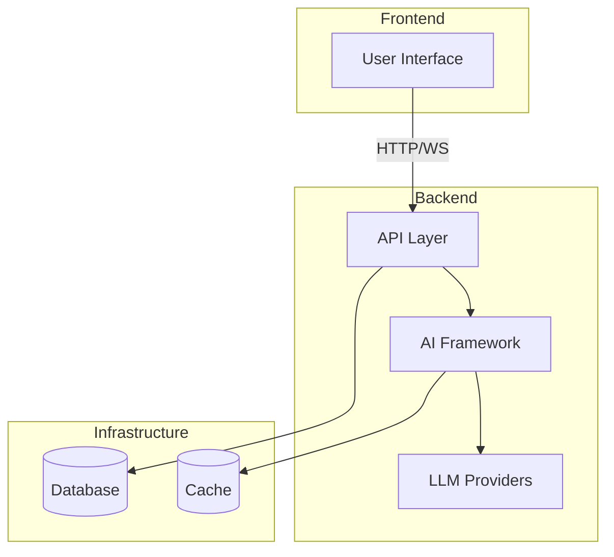

# AI-SDK-SEMANTIC-KERNEL

[](https://github.com/mk-knight23/AI-SDK-ECOSYSTEM)
[](https://github.com/microsoft/semantic-kernel)
[](https://astro.build/)
[](https://flask.palletsprojects.com/)

> **Framework**: Semantic Kernel (Microsoft AI Orchestration)
> **Stack**: Astro 5 + Flask + React

---

## 🎯 Project Overview

**AI-SDK-SEMANTIC-KERNEL** showcases Microsoft's Semantic Kernel for AI orchestration. It demonstrates plugin architecture, function calling, memory management, and planner patterns for building production AI applications.

### Key Features

- 🎯 **Plugin Architecture** - Modular, composable AI capabilities
- 🔌 **Function Calling** - Native OpenAI function calling support
- 🧠 **Memory System** - Conversation and semantic memory
- 📋 **Planner Patterns** - Stepwise and sequential planning
- 🔄 **Multi-Provider** - OpenAI, Azure OpenAI, Anthropic support
- 💬 **Chat Interface** - Full-featured chat UI
- 🔌 **Plugin Explorer** - Browse and test plugins
- 📊 **Memory Viewer** - Manage conversations and semantic memory
- 🎯 **AI Planner** - Plan and execute complex tasks

---

## 🛠 Tech Stack

| Technology | Purpose |
|-------------|---------|
| Astro 5 | Frontend framework |
| React 19 | Interactive components |
| Tailwind CSS | Styling |
| Flask 3 | Backend API |
| Semantic Kernel 1.19 | AI orchestration |
| Pydantic | Data validation |

---

## 🚀 Quick Start

### Prerequisites

- Python 3.10+
- Node.js 18+
- OpenAI API key (or Azure OpenAI/Anthropic)

### Backend Setup

```bash
cd backend

# Install dependencies
pip install -r requirements.txt

# Copy environment template
cp .env.example .env

# Edit .env and add your API key
# AI_API_KEY=your_openai_api_key_here

# Run the development server
python app.py
```

The backend will run on `http://localhost:5000`

### Frontend Setup

```bash
cd frontend

# Install dependencies
npm install

# Run the development server
npm run dev
```

The frontend will run on `http://localhost:4321`

---

## 🔌 Available Plugins

| Plugin | Description | Functions |
|--------|-------------|-----------|
| **Time** | Date and time operations | current_time, current_date, parse_date, add_days, day_of_week |
| **Calculator** | Mathematical calculations | add, subtract, multiply, divide, power, square_root |
| **Weather** | Weather information (mock) | current_weather, weather_forecast, temperature, will_rain |
| **Text** | Text processing | to_upper, to_lower, word_count, extract_emails, hash_text |

---

## 📡 API Endpoints

### Health & Status
- `GET /health` - Health check
- `GET /api/health` - API health check
- `GET /api/status` - Kernel status and configuration

### Chat
- `POST /api/chat` - Send message and get response

### Plugins
- `GET /api/plugins` - List all available plugins
- `POST /api/plugins/invoke` - Invoke a plugin function

### Memory
- `GET /api/conversations` - List conversations
- `POST /api/conversations` - Create conversation
- `GET /api/conversations/:id` - Get conversation details
- `DELETE /api/conversations/:id` - Delete conversation
- `GET /api/conversations/:id/messages` - Get conversation messages
- `GET /api/memory/semantic` - Get semantic memory value
- `POST /api/memory/semantic` - Set semantic memory value
- `DELETE /api/memory/semantic` - Delete semantic memory value

### Planner
- `POST /api/planner/plan` - Create and execute plan
- `POST /api/planner/think` - Think and act iteratively

---

## 🎯 Planner Patterns

### Stepwise Planner
Plans one step at a time, re-evaluating after each step. Best for:
- Complex, multi-step tasks
- Tasks requiring adaptability
- Tasks with uncertain paths

### Sequential Planner
Creates a complete plan upfront, then executes all steps. Best for:
- Well-defined tasks
- Tasks with clear execution paths
- Predictable workflows

---

## 🧪 Running Tests

```bash
cd backend

# Run all tests
pytest

# Run with coverage
pytest --cov=app --cov-report=html

# View coverage report
open htmlcov/index.html
```

---

## 📁 Project Structure

```
AI-SDK-SEMANTIC-KERNEL/
├── backend/
│   ├── app/
│   │   ├── api/          # Flask API routes
│   │   ├── kernel/       # Semantic Kernel configuration
│   │   ├── memory/       # Memory store implementation
│   │   ├── planners/     # Planner patterns
│   │   ├── plugins/      # Built-in plugins
│   │   └── models/       # Pydantic schemas
│   ├── tests/            # Test suite
│   └── requirements.txt
├── frontend/
│   ├── src/
│   │   ├── components/   # React components
│   │   ├── layouts/      # Astro layouts
│   │   ├── pages/        # Astro pages
│   │   └── styles/       # Global styles
│   └── package.json
└── README.md
```

---

## 🔧 Configuration

### Environment Variables

| Variable | Description | Default |
|----------|-------------|---------|
| `AI_PROVIDER` | AI provider (openai, azure_openai, anthropic) | `openai` |
| `AI_MODEL_ID` | Model identifier | `gpt-4o-mini` |
| `AI_API_KEY` | API key for the provider | - |
| `AI_TEMPERATURE` | Generation temperature | `0.7` |
| `AI_MAX_TOKENS` | Max tokens per response | `2000` |
| `PORT` | Backend port | `5000` |

### Azure OpenAI Configuration

```bash
AI_PROVIDER=azure_openai
AI_ENDPOINT=https://your-resource.openai.azure.com
AI_DEPLOYMENT_NAME=gpt-4o
AI_API_KEY=your_azure_api_key
```

### Anthropic Configuration

```bash
AI_PROVIDER=anthropic
AI_MODEL_ID=claude-3-5-sonnet-20241022
AI_API_KEY=your_anthropic_api_key
```

---

## 📝 License

MIT License - see [LICENSE](LICENSE) for details.

---


---

## 🏗️ Architecture



---

## 📡 API Endpoints

| Method | Endpoint | Description |
|--------|----------|-------------|
| GET | /health | Health check |
| POST | /api/execute | Execute agent workflow |
| WS | /api/stream | WebSocket streaming |

---

## 🔧 Troubleshooting

### Common Issues

**Connection refused**
- Ensure backend is running
- Check port availability

**Authentication failures**
- Verify API keys in `.env`
- Check environment variables

**Rate limiting**
- Implement exponential backoff
- Reduce request frequency

---

## 📚 Additional Documentation

- [API Reference](docs/API.md) - Complete API documentation
- [Deployment Guide](docs/DEPLOYMENT.md) - Platform-specific deployment
- [Testing Guide](docs/TESTING.md) - Testing strategies and coverage
---


**Part of the [AI-SDK Ecosystem](https://github.com/mk-knight23/AI-SDK-ECOSYSTEM)**
